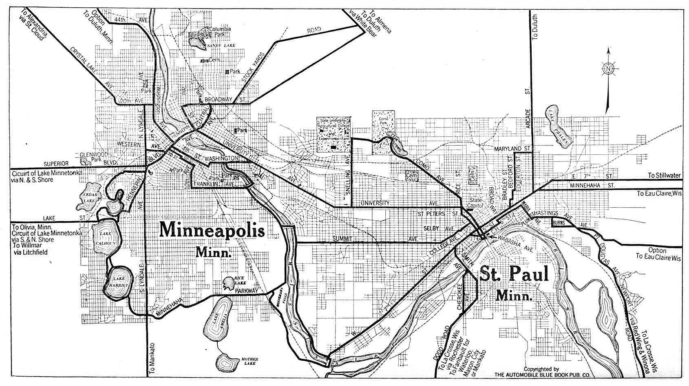

<h1 align="center">Time series and Deep Learning for traffic volume prediction</h1> 

<p align="center"> 
<a href="https://github.com/lprtk/forecast-hourly-traffic-volume/issues"></a> 
<a href="https://github.com/lprtk/forecast-hourly-traffic-volume/network"></a> 
<a href="https://github.com/lprtk/forecast-hourly-traffic-volume/stargazers"></a> 
<a href="https://github.com/lprtk/forecast-hourly-traffic-volume/"></a> 
</p> 


<p align="center">

</p>


## Table of contents 
* [Content :mag_right:](#Content)
* [Requirements :page_with_curl:](#Requirements)
* [File details :open_file_folder:](#File-details)
* [Features :computer:](#Features) 

<a id='section01'></a> 
## Content 

<p align="justify">This project focuses on modeling and forecasting hourly urban traffic volumes between two major U.S. cities in the state of Minnesota, Minneapolis and St. Paul, and evaluating the effects of various contextual characteristics such as days of the week, holidays, and weather conditions on traffic volumes.<p> 

<p align="justify">The dataset used catalogs hourly traffic volume on westbound Interstate 94 for the Minnesota State Department of Transportation ATR 301 station, roughly halfway between Minneapolis and St Paul. Initially, we have 48,000 observations ranging from October 2, 2012 at 9:00 AM to September 30, 2018 at 11:00 PM. To complete our traffic volume regression task, the company OpenWeatherMap added contextual and meteorological data: national and regional holidays, amount of rain and snow (in mm) that fell in 1 hour, temperature, cloud cover rate.<p>

<p align="justify">The objective is to try a large spectrum of approaches from the simplest to the most complex and by confronting the traditional Econometric approach and the new techniques of Machine and Deep Learning: <strong>linear regression</strong>, <strong>LightGBM</strong>, <strong>GRU</strong>, <strong>LSTM</strong>, <strong>Bi-LSTM</strong>.<br>
In a second step, we propose an opening towards Deep Hybrid Learning approaches with a <strong>CNN-LSTM</strong> model. Then, inspired by the ES-RNN, or MES-LSTM, observed during the Makridakis-4 (M4) forecasting contest, we wanted to try to implement a hybrid model merging a linear regression and the very powerful LightGBM. We operated very simply, the objective is to assign a weight $\alpha$ to the regression forecast and $1-\alpha$ to the LightGBM forecast. This $\alpha$ coefficient is determined by modeling an exponential curve, with a certain coefficient, in order to give more strength to the short-term forecasts of the regression and then to reverse the trend afterwards so as to provide a greater weight to the long-term forecasts of the LightGBM model. The performances of these two merged models are not phenomenal but we wanted to explore this track in order to go further and consider more interesting combinations such as ARIMA-LSTM models.<p>


<a id='section02'></a> 
## Requirements
* **Python version 3.9.7** 


<a id='section03'></a> 
## File details
* **forecast_hourly_traffic_volume** 
  * This is a .ipynb file which contains the code. 
* **data**
  * This folder contains the data.

</br> 

Here is the project pattern: 
```
- project 
    > forecast-hourly-traffic-volume
        > image 
            - map.JPG
        - forecast_hourly_traffic_volume.ipynb 
        > data 
            - interstate_traffic.csv
```

<a id='section04'></a> 
## Features 
<p align="center"><a href="https://github.com/lprtk/lprtk">My profil</a> • 
<a href="https://github.com/lprtk/lprtk">My GitHub</a> </p>
<a href="https://archive.ics.uci.edu/ml/datasets/Metro+Interstate+Traffic+Volume">Original dataset</a></p>
